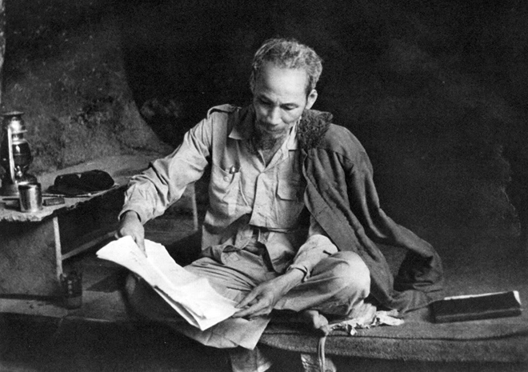

---
layout:
  title:
    visible: true
  description:
    visible: false
  tableOfContents:
    visible: true
  outline:
    visible: true
  pagination:
    visible: false
---

# Những tác phẩm trở thành “Bảo vật Quốc gia” của Chủ tịch Hồ Chí Minh

Chủ tịch Hồ Chí Minh đã hiến dâng trọn đời mình cho mục tiêu cao cả là giành độc lập, tự do cho Tổ quốc ta; mang ấm no, hạnh phúc cho nhân dân ta và để lại những giá trị nhân văn, cao quý cho nhân loại. Trước khi đi xa, Người đã để lại cho toàn Đảng và toàn dân di sản vô giá, đó là Tư tưởng Hồ Chí Minh.

<figure><figcaption>
Chủ tịch Hồ Chí Minh - vị lãnh tụ kính yêu của dân tộc Việt Nam.
</figcaption></figure>

Tư tưởng ấy được khắc hoạ rõ ràng và sâu sắc trong những tác phẩm, bút tích mà Người để lại, mà sau này 5 trong số đó được công nhận là Bảo vật Quốc gia, gồm: Đường Kách mệnh; Nhật ký trong tù (Ngục trung nhật ký); Lời kêu gọi Toàn quốc kháng chiến; Lời kêu gọi đồng bào và chiến sĩ cả nước; và Di chúc.
