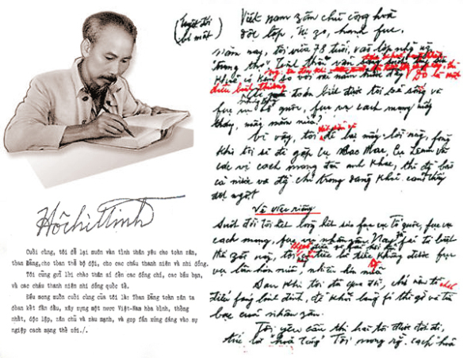

---
layout:
  title:
    visible: true
  description:
    visible: false
  tableOfContents:
    visible: true
  outline:
    visible: true
  pagination:
    visible: true
---

# Tác phẩm “Di chúc”

Tác phẩm cuối đời Người để lại cho dân tộc Việt Nam đó là bản “Di chúc” - một tài liệu quý giá, vừa chứa chan tình yêu thương với đồng bào vừa có ý nghĩa chiến lược trong sự phát triển của đất nước.

Di chúc được Người bắt đầu chấp bút từ tháng 5-1965 đến tháng 5-1969, ghi lại những suy nghĩ, lời căn dặn của một người “chuẩn bị đi xa” đối với những thế hệ sau nên đó tất nhiên là những điều rất thực, rất tâm huyết.

<figure><figcaption>
Chủ tịch Hồ Chí Minh và những bút tích của Người trong Di chúc.
</figcaption></figure>

Bảo vật Quốc gia cuối cùng mà Người để lại là sự kết tinh tinh thần tư tưởng, đạo đức và tâm hồn cao đẹp suốt đời phấn đấu hi sinh vì nước vì dân; vạch ra những định hướng mang tính cương lĩnh cho sự phát triển của đất nước sau khi kháng chiến thắng lợi; là những lời căn dặn thiết tha; là sức mạnh thôi thúc toàn dân tộc hành động trong xây dựng và bảo vệ Tổ quốc.

Là người sáng lập Đảng, Chủ tịch Hồ Chí Minh suốt đời chăm lo cho việc xây dựng Đảng, bảo đảm cho Đảng đủ điều kiện và sức mạnh lãnh đạo toàn dân tộc. Điều đầu tiên Bác nhắc tới trong Di chúc là nói về Đảng.&#x20;

Quan tâm tới con người luôn chiếm vị trí quan trọng trong chỉ đạo và điều hành đất nước của Chủ tịch Hồ Chí Minh. Trong Di chúc, Người nhắc đến tất thảy mọi người, từ "bà con lao động, công nhân, nông dân, thanh niên, học sinh, trí thức". Người căn dặn Đảng "phải có kế hoạch thật tốt để phát triển kinh tế và văn hóa, nhằm không ngừng nâng cao đời sống của nhân dân"...

<figure><figcaption>
Bản di chúc viết tay của Chủ tịch Hồ Chí Minh. Ảnh: Nhà xuất bản Trẻ
</figcaption></figure>

Chỉ với hơn 1.000 từ vô cùng ngắn gọn, Di chúc của Người đã truyền cho toàn Đảng, toàn dân và toàn quân ta ý chí quyết tâm sắt đá, niềm tin mãnh liệt vào sức mạnh vĩ đại của dân tộc Việt Nam; sức mạnh của chính nghĩa và chân lý "Không có gì quý hơn độc lập tự do"; sức mạnh của chủ nghĩa yêu nước và chủ nghĩa anh hùng cách mạng Việt Nam.
