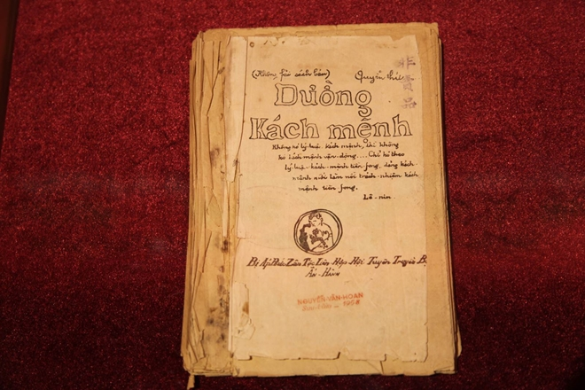

---
layout:
  title:
    visible: true
  description:
    visible: false
  tableOfContents:
    visible: true
  outline:
    visible: true
  pagination:
    visible: true
---

# Tác phẩm “Đường Kách mệnh”

Cách đây hơn 9 thập kỉ, năm 1927, "Đường Kách mệnh" - cuốn sách tập hợp các bài giảng của lãnh tụ Nguyễn Ái Quốc dùng để đào tạo lứa cán bộ đầu tiên cho cách mạng Việt Nam giai đoạn 1925-1927 ở Quảng Châu (Trung Quốc), lần đầu tiên được xuất bản. Đây được coi là văn kiện lý luận chính trị đầu tiên của Đảng, đặt cơ sở tư tưởng cho đường lối cách mạng Việt Nam.

<figure><figcaption>
Một bản thảo Đường Kách mệnh quý báu được lưu giữ tại Bảo tàng Lịch sử Quốc gia. Ảnh: Báo Du lịch
</figcaption></figure>

Thông qua những bài giảng trong "Đường Kách mệnh", Nguyễn Ái Quốc - Người cộng sản Việt Nam đầu tiên - đã trình bày những điều cốt lõi của học thuyết cách mạng Mác - Lênin, phù hợp với điều kiện của một nước thuộc địa nửa phong kiến, nông nghiệp lạc hậu. Điều này khẳng định tính phổ biến của các nguyên lý của học thuyết Mác - Lênin trên phạm vi toàn cầu, không chỉ ở châu Âu mà còn cả ở phương Đông, châu Á.

Trong tác phẩm, Người nêu rõ những chuẩn mực đạo đức của những người cách mạng. Đó phải là những người có nhân cách, đạo đức và phẩm hạnh thì mới tiếp thu được tinh thần của lý luận, mới làm tròn nhiệm vụ cách mạng khó khăn. "Đường Kách mệnh" cũng trình bày một cách hệ thống những vấn đề cơ bản của lý luận cách mạng, làm cơ sở cho việc hoạch định đường lối của cách mạng Việt Nam.

Trở thành "cẩm nang" gối đầu giường của thế hệ cách mạng đầu tiên của Việt Nam, dưới ánh sáng của "Đường Kách mệnh", những học trò của Nguyễn Ái Quốc đã về nước hoạt động, cùng Người chuẩn bị về chính trị, tư tưởng và tổ chức cho việc thành lập Đảng Cộng sản Việt Nam; phát động, tổ chức, lãnh đạo nhân dân Việt Nam đấu tranh, làm nên thắng lợi Cách mạng tháng Tám 1945, thành lập nước Việt Nam Dân chủ Cộng hòa, mở ra một kỷ nguyên mới trong lịch sử dân tộc.

Hơn 90 năm trôi qua, nhưng nhiều vấn đề có liên quan đến con đường, phương pháp cách mạng, xây dựng, tổ chức, đoàn kết các lực lượng cách mạng, về vai trò lãnh đạo của Đảng, công tác xây dựng Đảng vững mạnh, nhất là các chuẩn mực đạo đức của người cộng sản ... trong "Đường Kách mệnh" vẫn giữ nguyên tính thời sự trong sự nghiệp đổi mới hiện nay.
