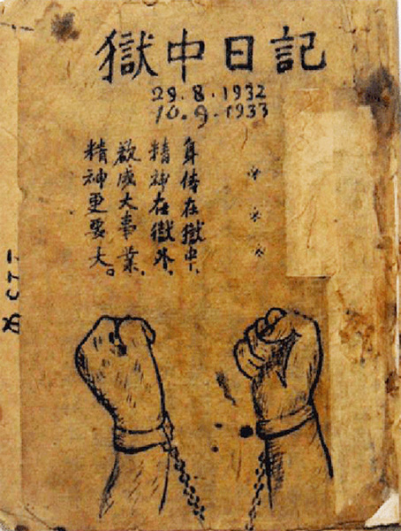

---
layout:
  title:
    visible: true
  description:
    visible: false
  tableOfContents:
    visible: true
  outline:
    visible: true
  pagination:
    visible: true
---

# Tác phẩm “Nhật ký trong tù”

<figure><figcaption>
Bìa tập "Nhật ký trong tù" của Chủ tịch Hồ Chí Minh.
</figcaption></figure>

Trong các văn phẩm của Chủ tịch Hồ Chí mInh, Nhật ký trong tù có một vị trí đặc biệt, được viết trong một hoàn cảnh đặc biệt, được dư luận trong nước và thế giới biết đến cũng rất đặc biệt. Đây không phải là bài thơ mà là một tập thơ, 135 bài thơ được viết bằng chữ Hán.Tháng 8-1942, với danh nghĩa là đại biểu Việt Nam Ðộc lập Ðồng minh và Phái bộ quốc tế chống xâm lược, Bác Hồ từ Cao Bằng sang Trung Quốc để vận động quốc tế ủng hộ cách mạng Việt Nam giành độc lập, nhưng đã bị chính quyền Tưởng Giới Thạch bắt giam vô cớ, sau đó giải qua nhiều nhà lao thuộc tỉnh Quảng Tây từ ngày 25-8-1942 đến ngày 19-9-1943.

Xuyên suốt tập thơ là hình ảnh người tù Hồ Chí Minh tràn đầy tinh thần yêu nước, ý chí kiên cường và một quyết tâm cao độ đấu tranh cho tự do. Dù tiếp cận ở những thời khắc khác nhau, song bất cứ ai đọc tác phẩm cũng đều phần nào hình dung được thế giới tâm hồn nhiều cung bậc của Người, thấy được tầm vóc trí tuệ của một chân dung vĩ đại, với khát vọng cao đẹp nhất là "Độc lập cho dân tộc và Tự do cho con người".

Độ lùi của thời gian càng xa, ta càng thêm những cảm nhận sâu lắng tự tâm hồn về một tác phẩm thơ với nghệ thuật văn chương và tầm tư tưởng đích thực. Hơn nữa, trong Nhật ký trong tù không chỉ có hình tượng thơ, có tâm hồn thi nhân, mà còn đầy ắp những sự kiện và tình huống của một tù nhân, bị giải đi khắp 13 huyện và hơn 30 nhà giam của tỉnh Quảng Tây (Trung Quốc). Người đã viết trong bài _Kết luận_ cuối tập thơ: “Ngục trung nhật ký từ đây dứt”. Đó chỉ là sự khép lại 13 tháng tù đày. Còn tâm hồn thơ, trí tuệ và bản lĩnh, phong cách thơ của Người mãi ngân vang trong đời sống tinh thần mỗi chúng ta, trong học tập và làm làm theo tư tưởng, đạo đức, phong cách của Người- hôm nay, mai sau và mãi mãi muôn đời, muôn thế hệ.
