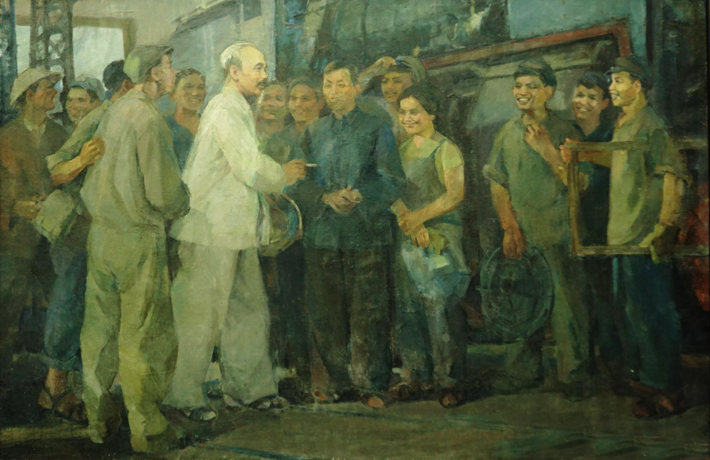

---
layout:
  title:
    visible: true
  description:
    visible: false
  tableOfContents:
    visible: false
  outline:
    visible: false
  pagination:
    visible: false
---

# Tác phẩm “Sửa đổi lối làm việc”

**TCCS - Năm 1947, tại chiến khu Việt Bắc, Chủ tịch Hồ Chí Minh đã viết tác phẩm “Sửa đổi lối làm việc”, với bút danh X.Y.Z. Những chỉ dẫn của Người trong “Sửa đổi lối làm việc” vẫn còn nguyên giá trị, ý nghĩa thiết thực đối với Đảng, các tổ chức đảng và mỗi cán bộ, đảng viên, nhất là với đội ngũ cán bộ lãnh đạo, quản lý các cấp trong công cuộc đẩy mạnh xây dựng, chỉnh đốn Đảng hiện nay.**

**Tư tưởng đổi mới của Chủ tịch Hồ Chí Minh trong điều kiện đảng cầm quyền qua các tác phẩm tiêu biểu**

Là người sáng lập và rèn luyện Đảng ta, Chủ tịch Hồ Chí Minh đặc biệt quan tâm tới công tác xây dựng, chỉnh đốn Đảng, làm cho Đảng thực sự trong sạch để thực sự vững mạnh, thực sự là Đảng chân chính cách mạng theo học thuyết đảng kiểu mới của V.I. Lê-nin.

Tư tưởng đổi mới của Người được hình thành từ rất sớm, bởi Người rất nhạy cảm với cái mới, từ tư duy đổi mới đến hành động đổi mới sáng tạo, quyết tâm thực hiện sự thay đổi trong cuộc hành trình tìm đường cứu nước, biến khát vọng giải phóng dân tộc thành hiện thực theo hệ giá trị Độc lập - Tự do - Hạnh phúc cho Tổ quốc - Dân tộc và nhân dân. Người đã lao động, học tập, tranh đấu suốt 30 năm để tìm chân lý cách mạng, với hoài bão, ý chí, nghị lực phi thường. Nguyễn Tất Thành - Nguyễn Ái Quốc - Hồ Chí Minh từ _tìm đường_, _nhận đường_, _chọn đường_ đã trở thành người _dẫn đường_ cho dân tộc ta trên _“Đường Cách mệnh”_ để thực hành lý tưởng độc lập dân tộc và chủ nghĩa xã hội.

<figure><figcaption>
Bác Hồ với công nhân xe lửa Gia Lâm_Ảnh: Tư liệu
</figcaption></figure>

Khi Đảng chưa ra đời, năm 1927, Nguyễn Ái Quốc đã viết _“Đường Cách mệnh”._ Đây là tập bài giảng lý luận cách mạng dùng cho các lớp huấn luyện cán bộ do Người tổ chức và trực tiếp giảng dạy tại Quảng Châu (Trung Quốc). Có thể xem _“Đường Cách mệnh”_ là một trong những tác phẩm đầu tiên truyền bá chủ nghĩa Mác - Lê-nin vào Việt Nam, sau khi Nguyễn Ái Quốc trở thành người cộng sản Việt Nam đầu tiên, khi Người tham gia Đại hội Tua ở Pháp, năm 1920, lúc đó Nguyễn Ái Quốc mới 30 tuổi. Người bỏ phiếu tán thành lập trường của Quốc tế III (Quốc tế Cộng sản), cùng với các đồng chí cộng sản Pháp. Đảng Cộng sản Pháp ra đời năm 1920 tại Đại hội lịch sử này và Nguyễn Ái Quốc được thừa nhận là một trong những người đồng sáng lập. Sau đó, Người đã có những đóng góp to lớn trong việc tổ chức ban nghiên cứu các vấn đề thuộc địa, xác định vai trò và trách nhiệm của đảng cộng sản ở chính quốc cần phải ủng hộ, quan tâm, giúp đỡ phong trào cách mạng ở các nước thuộc địa, chống chủ nghĩa đế quốc, chủ nghĩa thực dân để giải phóng dân tộc, giành độc lập. Đó là tư tưởng đổi mới của Người, khi tiếp thu tư tưởng của V.I. Lê-nin về quyền tự quyết của các dân tộc, từ luận cương về dân tộc và các vấn đề thuộc địa.

_“Đường Cách mệnh”_ là tác phẩm đặt nền móng tư tưởng, lý luận cho sự ra đời của Đảng Cộng sản Việt Nam vào năm 1930, do Người sáng lập. Bản Chính cương vắn tắt, Sách lược vắn tắt, Điều lệ vắn tắt của Đảng cũng do Người trực tiếp soạn thảo, cùng với thư kêu gọi các tầng lớp dân chúng ủng hộ Đảng, làm cách mạng giải phóng do Đảng lãnh đạo. Tư tưởng đổi mới của lãnh tụ Nguyễn Ái Quốc - Hồ Chí Minh thể hiện nổi bật ở các luận điểm được đề cập trong tác phẩm _“Đường Cách mệnh”._ Người xác định: “Cách mệnh là phá cái cũ đổi ra cái mới, phá cái xấu đổi ra cái tốt”(1). Cách mạng phải đến nơi (tức là triệt để) theo tấm gương Cách mạng Tháng Mười Nga, năm 1917 do V.I. Lê-nin và đảng kiểu mới lãnh đạo. “Trước hết phải có đảng cách mệnh”, “Đảng muốn vững thì phải có chủ nghĩa làm cốt”, “Đảng mà không có chủ nghĩa cũng như người không có trí khôn”, “Bây giờ học thuyết nhiều, chủ nghĩa nhiều, nhưng chủ nghĩa chân chính nhất, chắc chắn nhất, cách mệnh nhất là chủ nghĩa Lênin”(2). Dù hết sức dung dị trong diễn đạt, nhưng tư tưởng đổi mới sâu sắc của Người đã ở tầm kinh điển.

Một trong những điểm đặc sắc của _“Đường Cách mệnh”_ là ở chỗ, mở đầu tác phẩm lý luận này, Nguyễn Ái Quốc đặt lên hàng đầu vấn đề tư cách của người cách mạng. Người nhấn mạnh: “Giữ chủ nghĩa cho vững” và phải “Ít lòng tham muốn về vật chất”(3). Có như vậy, đảng cách mạng, người cách mạng mới làm tròn sứ mệnh cao cả của mình là thực hiện công cuộc giải phóng dân tộc, làm cách mạng thành công, quyền giao vào tay dân chúng số nhiều, tức là công - nông và đông đảo quần chúng lao động bị áp bức. Sự nghiệp vĩ đại ấy cần có sự soi đường của lý luận khoa học và cách mạng, cần có bản lĩnh chính trị vững vàng, kiên định của những người thực hành lý tưởng, lại phải có phẩm chất đạo đức trong sáng, biết hy sinh, tận tâm, tận lực phục vụ dân chúng. Sức mạnh ấy, là tất yếu cần thiết để vượt qua chủ nghĩa cá nhân mà Người nói rõ, đó là “giặc nội xâm” nguy hiểm nhất.

Theo tư tưởng của Người trong tác phẩm _“Đường Cách mệnh”,_ chỉ có sự kết hợp thống nhất và nhuần nhuyễn giữa trí tuệ khoa học với đạo đức cách mạng và bản lĩnh chính trị của đảng cách mạng, của người cách mạng, mới đủ sức tập hợp dân chúng thành lực lượng, mới giác ngộ và thức tỉnh dân chúng, đoàn kết họ, quy tụ họ thành phong trào theo đảng tiên phong, đưa cách mạng tới thành công. Sớm nhận ra vai trò của đạo đức cách mạng và sức mạnh của đoàn kết, đại đoàn kết toàn dân tộc, gắn liền với đoàn kết quốc tế trong công cuộc cách mạng giải phóng theo chủ nghĩa Mác - Lê-nin và tấm gương của Cách mạng Tháng Mười Nga, đó là sự nhạy cảm, sáng suốt, tầm nhìn xa trông rộng của Nguyễn Ái Quốc. Đó cũng là nét nổi bật, đặc trưng cho tư tưởng đổi mới của Người, ngay từ khi Đảng còn chưa ra đời.

Nhờ có tư tưởng đổi mới ấy, như kim chỉ nam hành động, như ánh sáng soi đường mà Nguyễn Ái Quốc cùng với Đảng Cộng sản Việt Nam do Người sáng lập và rèn luyện, đã lãnh đạo toàn thể dân tộc Việt Nam làm Cách mạng Tháng Tám năm 1945 thắng lợi, lập nên nước Việt Nam Dân chủ Cộng hòa, với bản _Tuyên ngôn Độc lập_ bất hủ. Đó là Tuyên ngôn lập quốc và dựng nước Việt Nam mới trong lịch sử Việt Nam hiện đại - Thời đại Hồ Chí Minh. Tầm vóc vĩ đại về tư tưởng đổi mới của Chủ tịch Hồ Chí Minh được Cách mạng Tháng Tám năm 1945 chứng thực ở chỗ, thắng lợi của Cách mạng Tháng Tám năm 1945 là thắng lợi của tư tưởng, của đường lối cách mạng và phương pháp cách mạng Hồ Chí Minh, giải quyết thành công mối quan hệ giữa dân tộc và giai cấp, giữa giải phóng dân tộc và giải phóng giai cấp khi Đảng ta trở thành đảng cầm quyền.

Trong thế kỷ XX, sau khi Cách mạng Tháng Mười Nga nổ ra và giành thắng lợi (ngày 7-11-1917), là thắng lợi Cách mạng Tháng Tám năm 1945 của Việt Nam. Sau Đảng Cộng sản Liên Xô ở vị trí đảng cộng sản cầm quyền là sự xác lập vị trí cầm quyền của Đảng ta. Với cách mạng Việt Nam, đó là bước ngoặt quan trọng, chứng thực thiên tài tư tưởng và tổ chức của Chủ tịch Hồ Chí Minh, một đóng góp vô giá vào phong trào cách mạng thế giới, làm phong phú và sâu sắc thêm kho tàng lý luận kinh điển của chủ nghĩa Mác - Lê-nin. Hai mươi năm sau kể từ khi viết tác phẩm _“Đường Cách mệnh”,_ và hai năm sau, kể từ khi Đảng ta trở thành đảng cầm quyền, Chủ tịch Hồ Chí Minh viết tác phẩm _“Sửa đổi lối làm việc”,_ năm 1947. Tư tưởng đổi mới của Người thể hiện trong tác phẩm quan trọng này, nổi bật ở hai điểm mang tính khái quát lý luận, cụ thể như sau:

_Thứ nhất_, đổi mới là cần thiết, tất yếu do sự phát triển của cách mạng đặt ra, khi Đảng lãnh đạo và cầm quyền đứng trước những biến chuyển phức tạp của tình hình mới, hoàn cảnh mới, nhiệm vụ mới. Chủ tịch Hồ Chí Minh dùng chữ “sửa đổi”, tức là “đổi mới”. Đó là nhận thức và hành động của Đảng, có trọng trách dẫn dắt và thúc đẩy phong trào cách mạng tiến lên trước những thử thách, bước ngoặt. Như Người đã định nghĩa về cách mạng là “phá cái cũ, đổi ra cái mới”, “phá cái xấu đổi ra cái tốt”, thì “sửa đổi”, “đổi mới”, thực sự mang tầm vóc cách mạng, thực sự là một cuộc cách mạng.

Năm 1947, cuộc kháng chiến toàn quốc chống thực dân Pháp xâm lược trở lại, đã bắt đầu. Trước đó, ngày 19-12-1946, Người đã ra lời kêu gọi “Toàn quốc kháng chiến”, với một thông điệp mạnh mẽ: “Chúng ta thà hy sinh tất cả, chứ nhất định không chịu mất nước, nhất định không chịu làm nô lệ”(4). Nhà nước cách mạng non trẻ vừa mới ra đời, đã phải đứng trước tình thế hiểm nghèo thù trong, giặc ngoài; vận nước, vận Đảng ở trong thế “nghìn cân treo sợi tóc”. Cả nước lên đường, toàn dân đánh giặc, quyết tử cho Tổ quốc quyết sinh. Cơ quan đầu não của Đảng và Chính phủ chuyển lên Việt Bắc, chỉ huy cuộc kháng chiến trường kỳ, toàn dân, toàn diện. Trước đây, nhờ Việt Bắc mà cách mạng thành công, nay lại nhờ Việt Bắc mà kháng chiến thắng lợi. Dự cảm sáng suốt của Chủ tịch Hồ Chí Minh những ngày đầu của chính thể mới, đã trở nên hoàn toàn chính xác. Từ tháng 11-1945, với một sách lược chính trị độc đáo, Đảng đã tuyên bố “tự giải tán”, nhưng về thực chất là rút vào hoạt động bí mật, Đảng vẫn lãnh đạo và cầm quyền bằng những phương thức phù hợp. Trong hoàn cảnh ấy, Người đã viết về Đảng trong tác phẩm _“Sửa đổi lối làm việc”,_ với hình thức diễn đạt là “ĐOÀN THỂ’; tuy nhiên, trong nội bộ Đảng, Người vẫn nói về Đảng, là một đảng chân chính cách mạng. Trong những năm kháng chiến chống thực dân Pháp xâm lược, có lúc Đảng còn được biểu đạt với tên gọi là “Hội nghiên cứu chủ nghĩa Mác”. Đến năm 1951, từ Đại hội II, Đảng ra hoạt động công khai với tên gọi “Đảng Lao động Việt Nam”, mà về bản chất vẫn là Đảng Cộng sản, như Người đã xác định từ đầu, khi thành lập Đảng ngày 3-2-1930.

Nhiệm vụ mới đặt ra lúc này là “vừa kháng chiến vừa kiến quốc”, với niềm tin và quyết tâm chính trị rất cao “kháng chiến tất thắng”, để “kiến quốc tất thành”. Chủ tịch Hồ Chí Minh là một nhà cách mạng kiên định, linh hồn của khối đại đoàn kết toàn dân tộc, có trọng trách tối cao trong lãnh đạo toàn Đảng, toàn dân, toàn quân “kháng chiến kiến quốc”. Chủ tịch Hồ Chí Minh là hiện thân sinh động nhất của tư tưởng và hành động đổi mới; do đó, phải kịp thời “sửa đổi”, kịp thời “đổi mới”, thấm nhuần sâu sắc và thực hành sáng tạo chỉ dẫn của V.I. Lê-nin; một khi tình hình đã thay đổi, nhiệm vụ và yêu cầu mới đã đặt ra, thì không bao giờ giải quyết hết được những nhiệm vụ của ngày hôm nay, nếu chỉ dựa trên hiểu biết, kinh nghiệm và phương pháp của ngày hôm qua.

Không phải ngẫu nhiên mà cùng trong năm 1947, giữa bao bộn bề công việc phải lo toan, Người tập trung viết tác phẩm _“Sửa đổi lối làm việc”,_ và trước đó, tháng 3-1947, Người viết tác phẩm _“Đời sống mới”,_ với bút danh Tân Sinh. Cả hai tác phẩm này đều nổi bật tư duy đổi mới, hành động đổi mới, ra sức giáo dục, rèn luyện đội ngũ cán bộ cả về phương pháp và phong cách lãnh đạo theo yêu cầu khoa học, dân chủ và sáng tạo trên nền tảng cốt yếu là ra sức thực hành đạo đức cách mạng, cần kiệm liêm chính, chí công vô tư, thực hành dân vận, thực hành đoàn kết, đại đoàn kết, gắn liền _quyết tâm_ với _tín tâm_ và _đồng tâm_ để quân, dân đồng lòng sản xuất, chiến đấu, hậu phương thi đua với tiền phương, tất cả cho chiến đấu, tất cả để chiến thắng quân thù. Muốn vậy, phải kịp thời “sửa đổi”, tức là “đổi mới” từ cách nghĩ, đến cách làm, từ tổ chức đến cán bộ, từ Đảng đến nhân dân, đã cùng mục đích thì cùng phấn đấu, hy sinh cho mục đích trở thành hiện thực.

_Thứ hai_, đổi mới phải chọn đúng khâu đột phá, tên tác phẩm của Người đã thể hiện rõ ràng tư tưởng và phương pháp đó; “Lối làm việc” tức là “phương pháp”, “cách thức”. Đây là điều cốt yếu phải đổi mới, hơn nữa, Người còn xác định điều hệ trọng: “PHẢI SỬA ĐỔI LỐI LÀM VIỆC CỦA ĐẢNG”(5). Mệnh đề này, trong tác phẩm của Người là câu trả lời cho khâu đột phá _ở đâu_ và _của ai_? Rõ ràng, Đảng phải tự đổi mới chính mình, đổi mới phương pháp, cách thức làm việc, tức là đổi mới phương thức lãnh đạo, cầm quyền của Đảng, như cách nói hiện nay, sao cho Đảng ngang tầm nhiệm vụ, làm tròn sứ mệnh của mình, phụng sự Tổ quốc, phục vụ nhân dân, đưa kháng chiến tới thắng lợi, để kiến quốc mau thành công. Đảng tự đổi mới chính bản thân mình, để thúc đẩy và dẫn dắt xã hội đổi mới. Muốn đổi mới, phải có dũng khí, tự nhận thức, tự phê phán, nhìn thẳng vào sự thật, nói rõ sự thật, đánh giá đúng sự thật, để phát hiện ra những yếu kém, khuyết điểm của mình và quyết tâm sửa chữa. Theo đó, mở đầu tác phẩm, Người tập trung làm rõ vấn đề “_Phê bình và sửa chữa_”. Đánh giá đúng những khuyết điểm đó, Người tập trung vào những căn bệnh mà đội ngũ cán bộ, đảng viên thường mắc phải, đó là “bệnh chủ quan”, “bệnh hẹp hòi” và “thói ba hoa”. “Đó là ba chứng bệnh rất nguy hiểm. Nếu không chữa ngay, để nó lây ra, thì có hại vô cùng”(6), có chung một nguồn gốc, một nguyên nhân, do “chủ nghĩa cá nhân, khuynh hướng tham danh vọng, tham địa vị, dìm người giỏi, bệnh hủ hóa, v.v., đều do bệnh hẹp hòi mà ra!”(7). Chủ nghĩa cá nhân là bệnh gốc, nó đẻ ra trăm nghìn bệnh tật, thói hư tật xấu, làm cho đội ngũ cán bộ, đảng viên hư hỏng, tổ chức suy yếu, nguy hại tới phong trào cách mạng, mà nguy hại nhất là suy giảm lòng tin của nhân dân với Đảng. Theo đó, đánh mất lòng tin, niềm tin của nhân dân, là Đảng tự đánh mất sức mạnh của mình, sức mạnh tự bảo vệ và được quần chúng nhân dân bảo vệ, mất cơ sở xã hội quan trọng nhất để cách mạng phát triển và thắng lợi. Từ sự phê phán nghiêm khắc đó, vạch rõ nguyên nhân để có quyết tâm sửa chữa, Chủ tịch Hồ Chí Minh phân tích và rút ra những kinh nghiệm, những bài học thu hoạch từ thực tiễn, nhằm nâng cao ý thức và trách nhiệm của Đảng, của đội ngũ cán bộ, đảng viên; đặc biệt là, phải thường xuyên củng cố vững chắc mối quan hệ mật thiết giữa Đảng với nhân dân.

Trong đấu tranh cách mạng giải phóng dân tộc, mà có tư tưởng xa dân và không được dân giúp đỡ, bảo vệ thì dù ai và tổ chức nào có tài giỏi mấy cũng không làm nên điều gì. Công tác dân vận phải đặt vào tầm chiến lược, quyết định thành công của sự nghiệp cách mạng là vì vậy. Trong những nhân tố bảo đảm cho cách mạng thành công, thì công tác tổ chức và chất lượng đội ngũ cán bộ, đảng viên là nhân tố cơ bản, quyết định nhất. Do đó, cách mạng phát triển thuận lợi hoặc khó khăn, thành công hay thất bại, suy đến cùng là do phẩm chất và năng lực của cán bộ quyết định; bởi “cán bộ là cái gốc của mọi công việc./ Vì vậy, huấn luyện cán bộ là công việc gốc của Đảng”(8). Đây là những tổng kết thực tiễn rất quan trọng để phát triển lý luận cách mạng của Chủ tịch Hồ Chí Minh. Người đặt cơ sở khoa học chính xác và thiết thực nhất cho công tác xây dựng, chỉnh đốn Đảng, nhất là trong điều kiện Đảng cầm quyền. Từ đó, _“Sửa đổi lối làm việc”_ đề cập đến “Tư cách của cán bộ, đảng viên”, “Tư cách của Đảng” và vạch ra hệ thống 12 điều cần hiểu đúng, làm đúng, nhất thiết không được xem nhẹ một điều nào. Đó là điều kiện để Đảng thật vững bền, là quan điểm, nguyên tắc và phương pháp “xây dựng đảng chân chính cách mạng” - 12 điều, vẻn vẹn trong 456 từ, mà toát lên lý luận xây dựng đảng cầm quyền, có giá trị và ý nghĩa về lý luận của Đảng Cộng sản Việt Nam cầm quyền, như một tất yếu cô đọng về học thuyết xây dựng, chỉnh đốn Đảng của Chủ tịch Hồ Chí Minh.

Tác phẩm còn dành một dung lượng lớn để nói về cách lãnh đạo, cách đánh giá, phát hiện, huấn luyện cán bộ, bố trí cán bộ, kiểm soát cán bộ, bảo vệ cán bộ, chính sách đối với cán bộ. Kết thúc tác phẩm, Người nói một cách thấm thía về “bệnh ba hoa” và “cách chữa bệnh ba hoa” trong cách nói và viết của cán bộ, rộng ra là thái độ và trách nhiệm của cán bộ với nhân dân. Như một người thầy thuốc, Người đã “khám bệnh” vô cùng kỹ lưỡng, “bắt mạch kê đơn” vô cùng thiết thực, chính xác để giúp cho việc chữa bệnh đối với những người mang bệnh thật sự có kết quả. Hiếm có tác phẩm nào, như tác phẩm _“Sửa đổi lối làm việc”_ được Người nói nhiều, nói kỹ tới các bệnh của đội ngũ cán bộ, đảng viên đến thế, vừa thẳng thắn, nghiêm khắc với tất cả tinh thần trách nhiệm, vừa tin tưởng và hy vọng rằng, đảng chân chính cách mạng biết đề cao tự phê bình và phê bình, biết dựa vào nhân dân để xây dựng Đảng, thì nhất định sẽ “_tẩy sạch_”, sẽ làm cho “_tiệt nọc_” (chữ dùng của Chủ tịch Hồ Chí Minh); những chứng bệnh nguy hiểm, nhờ đó, Đảng sẽ khỏe mạnh, chắc chắn, tiến bộ, trưởng thành, làm tròn sứ mệnh vẻ vang do dân tộc ủy thác và xứng đáng với niềm tin cậy của nhân dân, niềm tự hào của nhân dân về Đảng của mình. Rõ ràng, _“Sửa đổi lối làm việc”_ là tác phẩm điển hình về sự kết hợp nhuần nhuyễn giữa lý luận với thực tiễn, về tính chỉnh thể _Tư tưởng - Đạo đức - Phong cách Hồ Chí Minh_; ở đó, những nguyên lý xây dựng, chỉnh đốn Đảng được trình bày một cách khoa học, đầy sức thuyết phục, tầm tư tưởng sâu sắc được thể hiện một cách giản dị, trong sáng bởi ngôn từ và văn phong. Đã hơn nửa thế kỷ trôi qua, những vấn đề mà Người đặt ra trong tác phẩm vẫn không hề cũ, vẫn luôn luôn mới trong tình hình hiện nay đối với Đảng ta, với dân tộc và nhân dân ta.

<figure><figcaption>
Ủy viên Bộ Chính trị, Thủ tướng Chính phủ Phạm Minh Chính thăm hỏi đời sống, sản xuất của ngư dân tại huyện <a href="https://vi.wikipedia.org/wiki/Thu%E1%BA%ADn_Nam">Thuận Nam</a>, tỉnh <a href="https://vi.wikipedia.org/wiki/Ninh_Thu%E1%BA%ADn">Ninh Thuận</a>_Ảnh: chinhphu.vn
</figcaption></figure>

**Thấm nhuần sâu sắc những chỉ dẫn của Chủ tịch Hồ Chí Minh trong “Sửa đổi lối làm việc” để ra sức xây dựng, chỉnh đốn Đảng trong tình hình hiện nay**

Từ nội dung toàn diện và phong phú trong tác phẩm _“Sửa đổi lối làm việc”_, vận dụng vào công tác xây dựng, chỉnh đốn Đảng hiện nay, quyết tâm làm cho Đảng thực sự trong sạch, vững mạnh, xứng đáng là một đảng chân chính cách mạng, lãnh đạo và cầm quyền; toàn Đảng, từng tổ chức đảng và đội ngũ cán bộ, đảng viên, trước hết là các đảng viên giữ trọng trách lãnh đạo, quản lý các cấp, cần phải học tập thật thấu đáo để làm theo thật sự có hiệu quả _Tư tưởng - Đạo đức - Phong cách Hồ Chí Minh_ trên những vấn đề cốt yếu sau đây:

_Một là, phải có dũng khí tự phê bình và phê bình, sửa chữa bằng được những khuyết điểm và sai lầm_.

Theo Chủ tịch Hồ Chí Minh: “Cán bộ và đảng viên ta, vì bận việc hành chính hoặc quân sự, mà xao nhãng việc _học tập._ Đó là một khuyết điểm rất to. Từ nay, chúng ta cần phải thiết thực học tập, sửa chữa các khuyết điểm. Vì có tẩy sạch khuyết điểm, công việc mới có thể tiến bộ”(9). Coi trọng việc học tập trong Đảng, Người đã có những chỉ dẫn cụ thể việc học tập, từ tổ chức đến quy định thời gian, từ tài liệu, cách thức học tập, thảo luận, hướng dẫn cách phê bình đến kiểm tra, báo cáo và thực hành. Đặt vấn đề _học tập_ ngay ở phần mở đầu tác phẩm, Chủ tịch Hồ Chí Minh muốn nhắc nhở đội ngũ cán bộ, đảng viên, cần coi việc học tập là để mở mang sự hiểu biết, nâng cao nhận thức, là điều kiện cần thiết để thực hiện việc “phê bình và sửa chữa” có kết quả.

Người yêu cầu: “Mỗi cơ quan, bộ đội, đoàn thể phải tổ chức một ủy ban học tập, do cán bộ cao cấp lãnh đạo”, “Ủy ban này định ra kế hoạch; nghiên cứu, thảo luận, kiểm tra và thực hành”, “Mỗi người phải đọc kỹ càng các tài liệu, rồi tự kiểm điểm và kiểm điểm đồng chí mình, có khuyết điểm gì và ưu điểm gì”(10). Trong thảo luận, phê bình, Người nêu rõ: “mọi người được hoàn toàn tự do phát biểu ý kiến, dù đúng hoặc không đúng cũng vậy”,  “Những kết luận trong cuộc thảo luận phải có cấp trên duyệt y mới là chính thức”, “Mục đích phê bình cốt để giúp nhau sửa chữa, giúp nhau tiến bộ. Cốt để sửa đổi cách làm việc cho tốt hơn, đúng hơn. Cốt đoàn kết và thống nhất nội bộ”(11). Người nhấn mạnh: “Phê bình việc làm, chứ không phải phê bình người”(12); theo đó, về phương pháp tư tưởng, Chủ tịch Hồ Chí Minh đã giáo dục cán bộ, đảng viên về tôn trọng tự do tư tưởng, tôn trọng quyền dân chủ của mỗi người, đặc biệt là tôn trọng nhân cách, không xúc phạm nhân cách của đồng chí mình trong lúc phê bình. Đó là yêu cầu về đạo đức và văn hóa ứng xử trong tự phê bình và phê bình; có động cơ, mục đích đúng, còn phải đi liền với phương pháp khéo thì mới có kết quả. Đây là nét tinh tế, mà Người chỉ dẫn cho chúng ta trong xây dựng, chỉnh đốn Đảng; đòi hỏi trong Đảng, phải chú trọng thực hành lời dạy của Người về việc học tập, về cách tự phê bình và phê bình một cách trung thực, thẳng thắn, thấm nhuần các chuẩn mực đạo đức và văn hóa. Kết tinh những điều ấy, trong _Di chúc_, Người căn dặn: “Phải có tình đồng chí thương yêu lẫn nhau”(13); đồng thời, khắc phục khuyết điểm, phát huy ưu điểm, đó là điều mong mỏi thiết tha, chân thành, thường xuyên của Người đối với đội ngũ cán bộ, đảng viên. “Mọi người phải nhớ rằng: cộng nhiều khuyết điểm nhỏ thành một khuyết điểm to, sẽ rất có hại. Cộng nhiều ưu điểm nhỏ thành một ưu điểm lớn, rất lợi cho Đảng và công cuộc kháng chiến”(14).

Từ đây, Người đòi hỏi “phải sửa đổi lối làm việc của Đảng”. Theo Người: “Cán bộ và đảng viên làm việc không đúng, không khéo, thì còn nhiều khuyết điểm. Khuyết điểm nhiều thì thành tích ít. Khuyết điểm ít thì thành tích nhiều. Đó là lẽ tất nhiên. Vì vậy, ngay từ bây giờ, các cơ quan, các cán bộ, các đảng viên, mỗi người mỗi ngày _phải kiên quyết tự sửa chữa, và giúp đồng chí mình sửa chữa._ Phải như thế, Đảng mới chóng phát triển, công việc mới chóng thành công”; “Chúng ta có thể chia tất cả các khuyết điểm vào ba hạng: Khuyết điểm về tư tưởng, tức là bệnh _chủ quan_./ Khuyết điểm về sự quan hệ trong Đảng với ngoài Đảng, tức là bệnh _hẹp hòi./_ Khuyết điểm về cách nói và cách viết, tức là _ba hoa./_ Đó là ba chứng bệnh rất nguy hiểm. Nếu không chữa ngay, để nó lây ra, thì có hại vô cùng”; “Mỗi chứng bệnh sinh ra do nhiều nguyên nhân. Nhưng kết quả nó đều làm cho người ta ốm yếu. Nguyên nhân của bệnh chủ quan là: Kém lý luận, hoặc khinh lý luận, hoặc lý luận suông”(15). Người nhấn mạnh: “Mỗi cán bộ, mỗi đảng viên phải _học lý luận_, lý luận áp dụng vào công việc thực tế. Phải chữa cái bệnh kém lý luận, khinh lý luận và lý luận suông”, “chúng ta phải _gắng học,_ đồng thời học thì phải _hành_”(16). Nếu bệnh chủ quan thuộc về nhận thức, thì bệnh hẹp hòi thuộc về thái độ và cách cư xử trong các mối quan hệ trong việc dùng người, mà nhiều cán bộ, đảng viên thường mắc phải. Bệnh này rất nguy hiểm, _trong_ thì ngăn trở Đảng thống nhất và đoàn kết, _ngoài_ thì nó phá hoại sự đoàn kết toàn dân.

Phê phán bệnh hẹp hòi, nhất là hẹp hòi trong việc dùng người, cả trong Đảng lẫn ngoài Đảng, với những biểu hiện khác nhau, Người rút ra nhiều nhận xét, kết luận thấm thía. “Nhiều thứ bệnh, như chủ nghĩa địa phương, chủ nghĩa bản vị, chủ nghĩa cá nhân, khuynh hướng tham danh vọng, tham địa vị, dìm người giỏi, bệnh hủ hóa, v.v., đều do bệnh hẹp hòi mà ra!”, “Vì ham danh vọng và địa vị, cho nên khi phụ trách một bộ phận nào, thì lôi người này, kéo người khác, ưa ai thì kéo vào, không ưa thì tìm cách tẩy ra. Thế là chỉ biết có mình, chỉ biết có bộ phận mình mà quên cả Đảng. _Đó là một thứ bệnh hẹp hòi,_ trái hẳn với nguyên tắc tập trung và thống nhất của Đảng”, “Cũng vì bệnh hẹp hòi đó mà cán bộ cấp trên phái đến và cán bộ địa phương không đoàn kết chặt chẽ”, “không thân mật hợp tác”(17). Và theo Người: “Cũng vì bệnh _hẹp hòi_ mà không biết dùng nhân tài, việc gì cũng ôm lấy hết. Ôm lấy hết thì cố nhiên làm không nổi. Cũng vì bệnh _hẹp hò_i mà không biết cách xử trí khôn khéo với các hạng đồng bào. Từ nay, mỗi cán bộ, mỗi đảng viên, phải kiên quyết chữa cái bệnh hẹp hòi đó để thực hành _chính sách đại đoàn kết._ Chính sách thành công thì kháng chiến mới dễ thắng lợi. Bệnh chủ quan, bệnh ích kỷ, bệnh hẹp hòi, v.v., mỗi chứng bệnh là một kẻ địch. Mỗi kẻ địch bên trong là một bạn đồng minh của kẻ địch bên ngoài. Địch bên ngoài không đáng sợ. Địch bên trong đáng sợ hơn, vì nó phá hoại từ trong phá ra”(18). Bởi vậy, “Mỗi cán bộ, mỗi đảng viên, mỗi ngày phải tự kiểm điểm, tự phê bình, tự sửa chữa như mỗi ngày phải rửa mặt. Được như thế thì trong Đảng sẽ không có bệnh mà Đảng sẽ mạnh khoẻ vô cùng”(19). Người còn yêu cầu đội ngũ cán bộ, đảng viên phải chống thói ba hoa, vì thói này, cũng hại như hai bệnh kia (chủ quan và hẹp hòi): “Vì thói ba hoa còn, tức là bệnh chủ quan và bệnh hẹp hòi cũng chưa khỏi hẳn”(20).

Trong tác phẩm_“Sửa đổi lối làm việc”,_ Chủ tịch Hồ Chí Minh đã tổng kết từ thực tiễn để rút ra “Mấy điều kinh nghiệm”. Đó là một tổng kết đặc sắc gồm sáu điểm:

\- Có cán bộ tốt, việc gì cũng xong.\
\- Chính sách thì đúng, cách làm thì sai.\
\- Không biết nghiên cứu kinh nghiệm đến gốc.\
\- Phải nâng cao sáng kiến và lòng hăng hái.\
\- Vì ai mà làm? Đối ai phụ trách?\
\- Sát quần chúng, hợp quần chúng.

Những tổng kết đó, vừa là những kết luận có tính nguyên lý, vừa tiếp tục nêu lên những tình huống, nói rõ hạn chế, khuyết điểm phải ra sức khắc phục, trên tinh thần phê bình xây dựng, rất có ích trong phấn đấu, rèn luyện của đội ngũ cán bộ, đảng viên. Ở đây, Người đưa ra những chỉ dẫn rất quan trọng, đó là: “Muôn việc thành công hoặc thất bại, đều do cán bộ tốt hoặc kém. Đó là một chân lý nhất định”(21); “Dùng cán bộ không đúng tài năng của họ, cũng là một cớ thất bại”, “Từ nay, công việc gì bất kỳ thành công hoặc thất bại, chúng ta cần phải nghiên cứu đến cội rễ, phân tách thật rõ ràng rồi kết luận. Kết luận đó sẽ là cái _thìa khóa phát triển công việc và để giúp cho cán bộ tiến tới._ Có như thế thì người mới có tài, tài mới có dụng”(22). Đặc biệt là, Người thẳng thắn phê bình cách lãnh đạo của cán bộ, đảng viên không được dân chủ, cách công tác của ta không được tích cực. Đây là một yếu kém phải ra sức sửa chữa, nếu không sẽ ảnh hưởng tai hại tới sự đoàn kết và sức chiến đấu của Đảng, làm sai lệch đạo đức, nhân cách của người đảng viên. Theo Người, dân chủ, sáng kiến, hăng hái, ba điều đó rất quan hệ với nhau; phải làm cho đội ngũ cán bộ, đảng viên hiểu rõ, “bất kỳ việc gì cũng vì lợi ích của nhân dân mà làm và chịu trách nhiệm trước nhân dân”(23), phải _“Từ trong quần chúng ra. Về sâu trong quần chúng”_(24). Đó là tính nhân dân, là quan điểm quần chúng, mà người cách mạng phải thấm nhuần, phải nhất quán từ nhận thức đến hành động.

Xây dựng, chỉnh đốn Đảng với mục đích vì dân và trách nhiệm cao nhất với nhân dân. Đó là cơ sở, là nền tảng, là mục đích phục vụ nhân dân của đảng chân chính cách mạng. Một khi giác ngộ điều sâu xa, căn bản này, thì từng tổ chức đảng, từng cán bộ, đảng viên, phải nêu cao dũng khí tự phê bình và phê bình, quyết tâm làm cho Đảng thực sự trong sạch, vững mạnh, sao cho không phụ lòng nhân dân, xứng đáng với niềm tin của nhân dân đối với Đảng.

_Hai là, phải nêu cao tư cách của đảng chân chính cách mạng, ra sức làm tròn phận sự của đảng viên và cán bộ, phải dựa vào dân mà xây dựng, chỉnh đốn Đảng_.

Trong 12 điều cần thiết để xây dựng và bảo vệ tư cách của đảng chân chính cách mạng, Chủ tịch Hồ Chí Minh đã làm nổi bật một tư tưởng lớn: Đảng phải dựa vào dân mà xây dựng Đảng, phải không ngừng củng cố mối liên hệ mật thiết, bền chặt giữa Đảng với quần chúng nhân dân. Người nhấn mạnh bản chất, mục đích của Đảng. Đảng không phải là một tổ chức để làm quan, phát tài. Nó phải làm tròn nhiệm vụ giải phóng dân tộc, làm cho Tổ quốc giàu mạnh, đồng bào sung sướng. Điều _thứ nhất_ trong 12 điều cần thiết trong xây dựng Đảng liên quan đến động cơ phấn đấu vào Đảng của mỗi người. Đó cũng là điều hệ trọng nhất, nhất là khi Đảng đã cầm quyền, thì điều này lại càng vô cùng hệ trọng và thiêng liêng. Sai lạc về mục đích, động cơ phấn đấu, về lý tưởng và lẽ sống là khởi đầu dẫn đến suy thoái, biến dạng và hư hỏng. Nêu bật điểm đầu tiên này, Chủ tịch Hồ Chí Minh thức tỉnh chúng ta về đạo đức trong chính trị. Ý nghĩa thực tiễn sâu xa của vấn đề này trong xây dựng, chỉnh đốn Đảng hiện nay là Đảng phải hết sức chú trọng giáo dục mục đích, động cơ cho những người muốn phấn đấu vào Đảng; đồng thời, phải thường xuyên kiểm tra, đánh giá đội ngũ cán bộ, đảng viên về lòng trung thành với lý tưởng của Đảng, về sự tận tụy, hy sinh phục vụ nhân dân bằng việc làm, bằng hành động, chứ không chỉ căn cứ vào lời nói. Tư tưởng “dựa vào dân để xây dựng Đảng” được Chủ tịch Hồ Chí Minh làm rõ, bởi yêu cầu đặt ra của sự nghiệp cách mạng đối với mỗi đảng viên, đối với sự lãnh đạo của Đảng; phương pháp và phong cách mà Đảng chỉ ra cho mỗi đảng viên thể hiện trong mối quan hệ mật thiết với quần chúng nhân dân. Đó là nâng cao hiểu biết về lý luận cách mạng, gắn liền lý luận với thực hành, thấm nhuần quan điểm thực tiễn khi đặt ra khẩu hiệu và chỉ thị; thường xuyên xem xét lại tất cả công tác của Đảng, giữ vững nguyên tắc, liên hợp chặt chẽ với dân chúng, luôn đứng về phía quần chúng, chú trọng phương pháp (cách thức) tổ chức, giáo dục đảng viên và quần chúng. Theo đó, Người nhấn mạnh đến việc phải hết sức đề cao bản lĩnh tự phê bình và phê bình, không che giấu khuyết điểm, không sợ phê bình, giữ nghiêm kỷ luật, lựa chọn những người rất trung thành, rất hăng hái vào nhóm trung kiên lãnh đạo; đồng thời, tẩy bỏ những phần tử hủ hóa ra ngoài để làm cho Đảng trong sạch, vững mạnh.

<figure><figcaption>
Cán bộ Trung tâm Hành chính công tỉnh Quảng Ninh hướng dẫn công dân giải quyết các thủ tục hành chính_Nguồn: baoquangninh.com.vn
</figcaption></figure>

Theo Người: “Đảng phải luôn luôn xét lại những nghị quyết và những chỉ thị của mình đã thi hành thế nào. Nếu không vậy thì những nghị quyết và chỉ thị đó sẽ hóa ra lời nói suông mà còn hại đến lòng tin cậy của nhân dân đối với Đảng”(25). Vì vậy, thấm nhuần quan điểm “dựa vào dân để xây dựng, chỉnh đốn Đảng” của Chủ tịch Hồ Chí Minh hơn lúc nào hết, Đảng càng phải ra sức vận dụng, thực hiện nhất quán, với tinh thần khoa học và cách mạng, tôn trọng quyền làm chủ của nhân dân, hết lòng tin cậy nhân dân, rất mực trung thành và tận tụy phục vụ nhân dân; coi đó là thước đo về phẩm chất và năng lực của đội ngũ cán bộ, đảng viên, là bảo đảm vững chắc nhất để Đảng có sức mạnh từ niềm tin, sự gắn bó, sự giúp đỡ, ủng hộ và bảo vệ Đảng của nhân dân, được Chủ tịch Hồ Chí Minh coi là bí quyết của thành công.

Nêu lên 12 điều căn bản đó, Chủ tịch Hồ Chí Minh chỉ ra nội dung toàn diện của xây dựng, chỉnh đốn Đảng về chính trị, tư tưởng, đạo đức, tổ chức và cán bộ, mà sâu xa là xây dựng Đảng về văn hóa. Quan hệ mật thiết giữa Đảng với nhân dân, Đảng vì nhân dân, nên nhân dân tin Đảng và theo Đảng đến cùng. Đó là sức mạnh của Đảng, là văn hóa chính trị của đảng chân chính cách mạng đang thực thi sứ mệnh lãnh đạo, cầm quyền, làm tất cả vì Độc lập - Tự do - Hạnh phúc của Tổ quốc, của dân tộc và của nhân dân. Lời căn dặn của Người:

“Muốn cho Đảng được vững bền/ Mười hai điều đó chớ quên điều nào”(26), đến nay, vẫn còn nguyên giá trị và ý nghĩa kim chỉ nam hành động của Đảng ta.

_Thứ ba, phải tạo ra những chuyển biến căn bản có tính đột phá về công tác cán bộ, về đổi mới phương pháp và phong cách lãnh đạo của Đảng, làm cho Đảng ngang tầm nhiệm vụ, tiêu biểu cho trí tuệ, đạo đức và văn hóa của dân tộc, của thời đại_.

Đại hội XIII của Đảng nhấn mạnh: “Công tác xây dựng, chỉnh đốn Đảng phải được triển khai quyết liệt, toàn diện, đồng bộ, thường xuyên cả về chính trị, tư tưởng, đạo đức, tổ chức và cán bộ”(27); đó là một chỉnh thể, mà sâu xa là xây dựng Đảng về văn hóa, xây dựng văn hóa trong Đảng. Muốn làm cho Đảng và cả hệ thống chính trị do Đảng lãnh đạo thực sự trong sạch, vững mạnh toàn diện, “là đạo đức, là văn minh”, như Chủ tịch Hồ Chí Minh nói về Đảng, thì toàn Đảng, toàn dân, toàn quân phải ra sức học tập và làm theo tư tưởng, đạo đức, phong cách Hồ Chí Minh; coi đây là một giải pháp chiến lược trong công cuộc xây dựng, chỉnh đốn Đảng. Tiếp tục đẩy mạnh việc học tập và làm theo tư tưởng, đạo đức, phong cách Hồ Chí Minh cần và phải thực sự trở thành một nhu cầu văn hóa của mỗi người, mỗi cơ quan, đơn vị, tổ chức trong toàn Đảng, trong cả nước.

Tác phẩm _“Sửa đổi lối làm việc”_ của Chủ tịch Hồ Chí Minh không chỉ có giá trị lý luận, mà còn có giá trị thực tiễn sâu sắc trong việc xây dựng hệ giá trị chuẩn mực cho đội ngũ cán bộ, đảng viên; trước hết là ở những người lãnh đạo, theo tinh thần “chức vụ càng cao, càng phải gương mẫu”, ra sức thực hành trách nhiệm nêu gương cho quần chúng noi theo, làm theo. Một tấm gương sống còn có giá trị hơn một trăm bài diễn văn tuyên truyền. Từ lâu, Người đã nói như vậy, cũng như Người đã từng nhấn mạnh, lãnh đạo bằng sự gương mẫu là cách lãnh đạo tốt nhất, hợp với lòng dân và được lòng dân nhất. Cán bộ phải thực sự là tinh hoa, không chỉ đủ phẩm chất, năng lực, tương xứng với yêu cầu, nhiệm vụ, mà còn phải có uy tín trong sự nhìn nhận, đánh giá của nhân dân, được thừa nhận qua dư luận xã hội.

Vấn đề cán bộ, công tác cán bộ và chính sách cán bộ, cũng như cách lãnh đạo, đổi mới phương pháp và phong cách lãnh đạo của Đảng trong điều kiện Đảng cầm quyền, được Chủ tịch Hồ Chí Minh chỉ dẫn hết sức tỉ mỉ, khoa học. Nếu thực sự thấm nhuần và thực sự có quyết tâm hành động, lời nói đi đôi với việc làm, đã nói thì phải làm, đã hứa trước Đảng, trước nhân dân thì phải thực hiện, không chỉ nêu cao _quyết tâm,_ mà còn giữ trọn _tín tâm_, nỗ lực hết mình thực hiện đoàn kết dân chủ và đồng thuận trong Đảng, trong nhân dân, thì nhất định sẽ tạo ra đột phá về chất lượng đội ngũ cán bộ, chất lượng tổ chức, “thanh toán” triệt để tình trạng yếu kém kéo dài từ bấy lâu nay về công tác tổ chức, công tác cán bộ.

Chúng ta cần lĩnh hội những chỉ dẫn của Chủ tịch Hồ Chí Minh về vấn đề cốt yếu này. Người căn dặn chúng ta, “cán bộ là cái gốc của mọi công việc” và “huấn luyện cán bộ là công việc gốc của Đảng”(28). Người không chỉ chú trọng huấn luyện cán bộ, từ huấn luyện nghề nghiệp đến huấn luyện chính trị, huấn luyện văn hóa, huấn luyện lý luận làm cho cán bộ có đủ năng lực, có tầm nhìn xa trông rộng, có bản lĩnh sáng tạo và dám chịu trách nhiệm, mà còn ân cần chỉ dẫn cho chúng ta việc “dạy cán bộ và dùng cán bộ”, thận trọng trong lựa chọn cán bộ, có cách (phương pháp) đối với cán bộ cho đúng và cho khéo, sao cho từ phong trào thực tiễn, mà nảy nở rất nhiều nhân tài; trong đó, có cả “nhân tài ngoài Đảng”, để Đảng và Chính phủ trọng dụng, vì lợi ích của cách mạng, của dân tộc và của nhân dân. Chủ tịch Hồ Chí Minh là nhà lãnh đạo, nhà tổ chức thiên tài, bằng trí tuệ mẫn tiệp, có _“tầm mắt đại dương”,_ lại giàu lòng nhân ái, khoan dung, Người còn nhấn mạnh những điểm lớn trong chính sách cán bộ. Người nói rõ: “Sao cho đối đãi đúng với mọi người? Đó là một vấn đề rất trọng yếu”(29), bởi nó kích thích được tài năng, tạo ra động lực cho cán bộ phát triển và cống hiến. Tổng kết của Người là cẩm nang cho cán bộ lãnh đạo trong việc dùng người gồm năm điểm: “Hiểu biết cán bộ,/ Khéo dùng cán bộ,/ Cất nhắc cán bộ,/ Thương yêu cán bộ,/ Phê bình cán bộ”(30). Người nêu lên những quan niệm khoa học thấm sâu tinh thần thực tiễn và đổi mới, đặc biệt là muốn dùng cán bộ cho đúng, thì người lãnh đạo phải thực sự có trí tuệ, có đạo đức, thật sự công tâm, khách quan, vì sự nghiệp chung, vì lợi ích tối cao của nhân dân, của đất nước, mà dùng người thực đức, thực tài, không thiên tư thiên vị, không định kiến hẹp hòi; đồng thời, phải có bản lĩnh chính trị dám quyết, dám chịu trách nhiệm, “Ai sợ phụ trách và không có sáng kiến thì không phải người lãnh đạo”(31). Chủ tịch Hồ Chí Minh thường xuyên chú trọng công tác kiểm tra cán bộ, “Giao công việc mà không kiểm tra, đến lúc thất bại mới chú ý đến. Thế là không biết yêu dấu cán bộ”(32). Cũng như vậy, kiểm tra, phê bình cán bộ là cần thiết, tất yếu, là thái độ chủ động trong bảo vệ cán bộ, nghiêm mà vẫn bao dung, thấu lý, đạt tình là điểm đặc sắc trong phương pháp và phong cách của Người, là chất nhân văn, chủ nghĩa nhân văn của Chủ tịch Hồ Chí Minh. Người phê phán nghiêm khắc những chứng bệnh mà không ít cán bộ lãnh đạo có trọng trách dùng người, nhưng dùng không đúng thường mắc phải; đó là “Tự cao tự đại,/ Ưa người ta nịnh mình,/ Do lòng yêu, ghét của mình mà đối với người,/ Đem một cái khuôn khổ nhất định, chật hẹp mà lắp vào tất cả mọi người khác nhau”(33).

Người để lại cho chúng ta những thu hoạch vô cùng bổ ích, chắt lọc và kết tinh vô vàn những kinh nghiệm và trải nghiệm trong nhiều thập niên hoạt động cách mạng của mình, thiết nghĩ vào lúc này, những cán bộ lãnh đạo cần vận dụng, thực hành cho tốt. “Phải trọng nhân tài, trọng cán bộ, trọng mỗi một người có ích cho công việc chung của chúng ta”(34), “Mình càng ít khuyết điểm thì cách xem xét cán bộ càng đúng”(35), “Chúng ta không sợ có sai lầm và khuyết điểm, chỉ sợ không chịu cố gắng sửa chữa sai lầm và khuyết điểm. Và càng sợ những người lãnh đạo không biết tìm cách đúng để giúp cán bộ sửa chữa sai lầm và khuyết điểm”(36). Công tác cán bộ gắn liền với công tác tổ chức và ngược lại. Xây dựng, chỉnh đốn Đảng về tổ chức, về cán bộ có liên quan trực tiếp tới công tác lãnh đạo và đổi mới phương thức, phong cách lãnh đạo. Đảng phải dày công trong công tác cán bộ, xây dựng một đội ngũ cán bộ có chất lượng cao về mọi mặt, đặc biệt là Đảng ta nhấn mạnh vào phẩm chất, năng lực, uy tín. Trong tác phẩm_“Sửa đổi lối làm việc”,_ những kiến giải của Chủ tịch Hồ Chí Minh về cách lãnh đạo, có rất nhiều điểm đặc sắc. Độ lùi của thời gian càng xa, thì những luận điểm của Người càng có sức tỏa sáng, trở thành những giá trị bền vững - xét về mặt tư tưởng, thấm nhuần triết lý của Người và cả về đạo đức và phong cách, mà ngày nay Đảng ta cần vận dụng và phát triển sáng tạo trong điều kiện mới.

Theo Chủ tịch Hồ Chí Minh, lãnh đạo đúng nghĩa là: “Phải quyết định mọi vấn đề một cách cho đúng”, “Phải tổ chức sự thi hành cho đúng”, “Phải tổ chức sự kiểm soát, mà muốn kiểm soát đúng thì cũng phải có quần chúng giúp mới được”(37); cả ba việc ấy đều cần phải dựa vào nhân dân, có sự giúp đỡ của nhân dân. Người còn nhấn mạnh: “Muốn kiểm soát có kết quả tốt, phải có hai điều: một là việc kiểm soát phải có hệ thống, phải thường làm. Hai là người đi kiểm soát phải là những người rất có uy tín”(38). Để thực hiện sự lãnh đạo theo quan niệm nêu trên, Người căn dặn chúng ta, phải liên hợp chính sách chung với sự chỉ đạo riêng; đồng thời, liên hiệp người lãnh đạo với quần chúng. Lại phải chú ý “vừa lãnh đạo vừa học tập”, đối với dân chúng phải biết phát huy vai trò của bộ phận quần chúng tiên tiến, nâng đỡ lớp quần chúng trung bình cho họ tiến bộ, biết cách thuyết phục, cảm hóa những quần chúng chậm tiến. Người cũng đòi hỏi phải, “phá tan cách lãnh đạo lờ mờ, quan liêu, chủ quan, bàn giấy”, “Học hỏi quần chúng nhưng không theo đuôi quần chúng”(39).

Những chỉ dẫn trên đây của Người là cơ sở để chúng ta rút ra những thu hoạch về khoa học và nghệ thuật trong lãnh đạo và quản lý; đó là: Lãnh đạo bằng khoa học, lãnh đạo một cách dân chủ, lãnh đạo bằng sự gương mẫu, tiên phong, nhất là sự gương mẫu về đạo đức của người lãnh đạo. Còn nhiều vấn đề khác, được Chủ tịch Hồ Chí Minh đề cập trong tác phẩm quan trọng này, nhưng tất cả đều quy tụ vào nội dung xây dựng, chỉnh đốn Đảng, vào vai trò của quần chúng trong việc giúp đỡ, hỗ trợ, ủng hộ Đảng và điều mấu chốt là _Đảng phải dựa vào nhân dân, củng cố mối liên hệ bền chặt với nhân dân_. Đó vừa là cơ sở xã hội rộng lớn của Đảng, vừa là nguồn xung lực mạnh mẽ, giúp Đảng không ngừng phát triển, thực sự trong sạch, vững mạnh, xứng đáng với trọng trách lãnh đạo, cầm quyền, đưa sự nghiệp cách mạng tới thắng lợi, vì cuộc sống ấm no, hạnh phúc của nhân dân.

**Một số kiến nghị**

_Một là_, nhân kỷ niệm 75 năm Chủ tịch Hồ Chí Minh viết tác phẩm _“Sửa đổi lối làm việc”_ (và tác phẩm _“Đời sống mới”_) - những tác phẩm tiêu biểu cho tư tưởng đổi mới của Người trong điều kiện Đảng cầm quyền, cần tổ chức giáo dục, tuyên truyền sâu rộng giá trị và ý nghĩa những tác phẩm này trong Đảng, trong dân; coi đây là một điểm nhấn về lý luận - thực tiễn trong chủ đề “Học tập và làm theo tư tưởng, đạo đức, phong cách\
Hồ Chí Minh” năm 2022, góp phần tạo động lực thúc đẩy _khát vọng cống hiến_ của mỗi người, _khát vọng phát triển đất nước phồn vinh, hạnh phúc_ của toàn dân tộc.

_Hai là_, xuất phát từ tầm vóc tư tưởng, với những giá trị bền vững và phong cách đặc sắc của Chủ tịch Hồ Chí Minh thể hiện qua tác phẩm, Đảng và Nhà nước ta cần đưa tác phẩm _“Sửa đổi lối làm việc”_ vào danh mục các tác phẩm Bảo vật quốc gia của Chủ tịch Hồ Chí Minh, làm phong phú và sâu sắc thêm kho tàng di sản các bảo vật quốc gia của Việt Nam.

_Ba là_, cùng với việc đó, một việc làm cần thiết, cấp bách lúc này là phải đưa _“Tuyên ngôn Độc lập” -_ Bản tuyên ngôn lập quốc, dựng nước Việt Nam mới, mà cả dân tộc và thế giới đều biết đến tác giả khởi thảo và tuyên đọc văn kiện vô giá này là Chủ tịch Hồ Chí Minh vĩ đại, vào danh mục bảo vật quốc gia của Việt Nam. Việc bổ sung chính thức tác phẩm vĩ đại này là hết sức cần thiết, có ý nghĩa đặc biệt trong di sản tư tưởng và văn hóa của Việt Nam - Thời đại Hồ Chí Minh./.

***

> (1) Hồ Chí Minh: _Toàn tập,_ Nxb. Chính trị quốc gia Sự thật, Hà Nội, 2011, t. 2, tr. 284\
> (2), (3) Hồ Chí Minh: _Toàn tập,_ _Sđd,_ t. 2, tr. 289, 280\
> (4) Hồ Chí Minh: _Toàn tập, Sđd,_ t. 4, tr. 534\
> (5) Hồ Chí Minh: _Toàn tập, Sđd,_ t. 5, tr. 272\
> (6), (7), (8) Hồ Chi Minh: _Toàn tập, Sđd,_ t. 5, tr. 273, 276, 309\
> (9), (10), (11), (12) Hồ Chí Minh: _Toàn tập, Sđd,_ t. 5, tr. 271, 217, 272, 272\
> (13) Hồ Chí Minh: _Toàn tập, Sđd,_ t. 15, tr. 622\
> (14), (15), (16), (17) Hồ Chí Minh: _Toàn tập, Sđd,_ t. 5, tr. 272, 274, 276\
> (18), (19), (20), (21), (22), (23), (24) Hồ Chí Minh: _Toàn tập, Sđd,_ t. 5, tr. 278, 279, 339, 280, 283, 285, 288\
> (25), (26) Hồ Chí Minh: _Toàn tập, Sđd,_ t. 5, tr. 290\
> (27) _Văn kiện Đại hội đại biểu toàn quốc lần thứ XIII,_ Nxb. Chính trị quốc gia Sự thật, Hà Nội, 2021, t. I, tr. 95\
> (28) Hồ Chí Minh: _Toàn tập, Sđd,_ t. 5, tr. 309\
> (29), (30), (31), (32), (33), (34), (35), (36) Hồ Chí Minh: _Toàn tập, Sđd,_ t. 5, tr. 317, 317, 315, 316, 317, 313, 317, 323\
> (37), (38), (39) Hồ Chí Minh: _Toàn tập, Sđd,_ t. 5, tr. 325

> Nguồn: [https://www.tapchicongsan.org.vn/web/guest/chinh-tri-xay-dung-dang/-/2018/826441/tac-pham-%E2%80%9Csua-doi-loi-lam-viec%E2%80%9D-voi-su-nghiep-xay-dung%2C-chinh-don-dang-theo-tu-tuong-ho-chi-minh-hien-nay.aspx](https://www.tapchicongsan.org.vn/web/guest/chinh-tri-xay-dung-dang/-/2018/826441/tac-pham-%E2%80%9Csua-doi-loi-lam-viec%E2%80%9D-voi-su-nghiep-xay-dung%2C-chinh-don-dang-theo-tu-tuong-ho-chi-minh-hien-nay.aspx)
